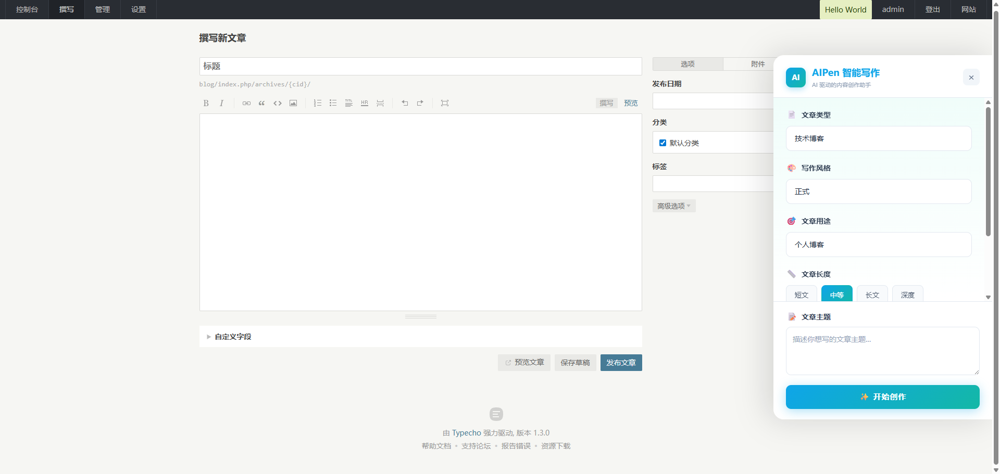
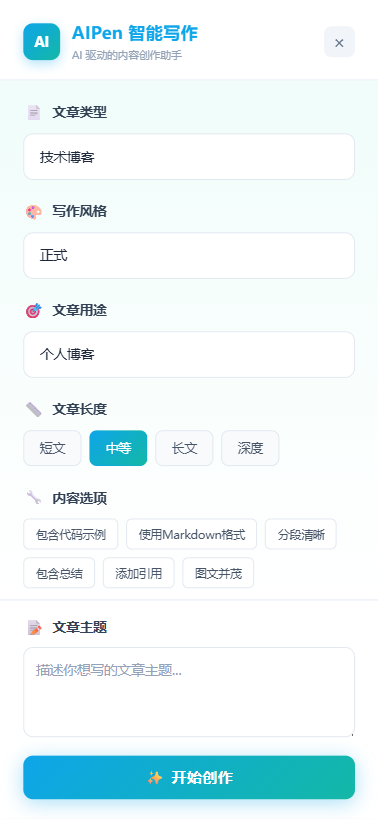
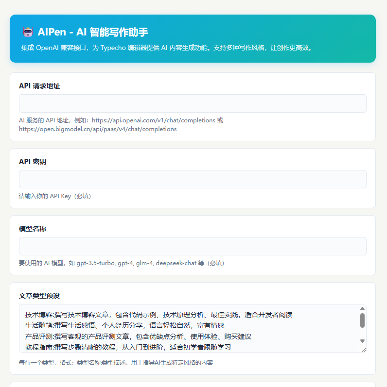

# AIPen - Typecho AI 智能写作助手

> 作者：优优
> 官网：https://blog.uuhb.cn
> 版本：1.0.0

## 插件简介

AIPen 是一款为 Typecho 博客系统开发的 AI 写作助手插件。通过集成各类 AI 服务，帮助用户快速生成高质量的文章内容。支持多种写作风格、文章类型和用途配置，让 AI 创作更贴合你的需求。

## 主要特性

- ✨ **灵活配置**：支持任何兼容 OpenAI 格式的 API 接口
- 🎨 **多种风格**：预设多种写作风格，满足不同场景需求
- 📄 **文章类型**：技术博客、生活随笔、产品评测等多种类型
- 🎯 **用途适配**：个人博客、公司官网、知识分享等不同平台
- 📏 **长度控制**：支持短文、中等、长文、深度长文多种长度
- 🔧 **内容结构**：可自定义内容结构选项（代码示例、Markdown格式等）
- 🚀 **流式生成**：实时流式输出，边生成边显示
- 💫 **精美UI**：现代化侧边栏设计，支持移动端响应式
- 🔄 **一键插入**：生成内容自动插入编辑器

## 界面预览

### PC 端界面


### 移动端界面


## 安装方法

1. 下载插件文件，上传到 `/usr/plugins/AIPen/` 目录
2. 登录 Typecho 后台，进入「插件」管理页面
3. 找到「AIPen」插件，点击「启用」
4. 进入插件配置页面，完成必填配置（见下方）

## 配置说明

### 后台配置界面


### 必填配置项

#### 1. API 请求地址
你的 AI 服务接口地址，常用示例：
- **OpenAI**: `https://api.openai.com/v1/chat/completions`
- **智谱 AI (GLM-4)**: `https://open.bigmodel.cn/api/paas/v4/chat/completions`
- **DeepSeek**: `https://api.deepseek.com/v1/chat/completions`
- **通义千问**: `https://dashscope.aliyuncs.com/compatible-mode/v1/chat/completions`
- **其他兼容 OpenAI 格式的第三方代理服务**

#### 2. API 密钥
你的 API Key（必填），从对应的 AI 服务商获取

#### 3. 模型名称
要使用的 AI 模型（必填），常用示例：
- **OpenAI**: `gpt-3.5-turbo`, `gpt-4`, `gpt-4-turbo`, `gpt-4o`
- **智谱 AI**: `glm-4`, `glm-3-turbo`
- **DeepSeek**: `deepseek-chat`, `deepseek-coder`
- **通义千问**: `qwen-turbo`, `qwen-plus`, `qwen-max`

### 可选配置项

#### 文章类型预设
定义文章的类型和描述，每行一个，格式：`类型名称:类型描述`

默认预设：
```
技术博客:撰写技术博客文章，包含代码示例、技术原理分析、最佳实践，适合开发者阅读
生活随笔:撰写生活感悟、个人经历分享，语言轻松自然，富有情感
产品评测:撰写客观的产品评测文章，包含优缺点分析、使用体验、购买建议
教程指南:撰写步骤清晰的教程，从入门到进阶，适合初学者跟随学习
新闻资讯:撰写简洁的新闻资讯，客观报道事件，包含背景信息和影响分析
观点评论:撰写有深度的观点评论，包含论点、论据和独特见解
```

#### 文章用途预设
定义文章的发布平台和用途，每行一个，格式：`用途名称:用途描述`

默认预设：
```
个人博客:轻松个人化，有观点和情感，适合个人表达
公司官网:专业正式，体现品牌形象，避免过于口语化
知识分享:详细易懂，注重实用性，让读者学到知识
技术文档:准确规范，逻辑清晰，便于查阅和操作
社交媒体:简短精炼，开头吸引眼球，便于传播
```

#### 文章长度
选择默认的文章生成长度：
- **短文** (500-800字)
- **中等** (1000-1500字)
- **长文** (2000-3000字)
- **深度长文** (3000字以上)

#### 写作风格预设
定义写作风格和对应的提示词，每行一个，格式：`风格名称:提示词`

默认预设：
```
正式:以正式、专业的语调撰写文章，适合商务场景
轻松:以轻松、幽默的语调撰写，适合博客分享
学术:以学术、严谨的语调撰写，适合研究论文
营销:以营销、推广的语调撰写，突出产品优势
```

#### 内容结构选项
定义可附加到文章中的结构要求，每行一个，格式：`选项名:选项描述`

默认预设：
```
包含代码示例:在技术内容中穿插实际可运行的代码片段
使用Markdown格式:使用标准Markdown语法，包括标题、列表、代码块等
分段清晰:使用小标题将内容分成多个逻辑段落
包含总结:在文章末尾添加总结或要点回顾
添加引用:适当引用权威来源或相关资料
图文并茂:描述配图建议或图表说明
```

#### 系统提示词
自定义 AI 的系统提示词，用于设定 AI 的角色和基本要求

默认值：
```
你是一位专业的博客文章写手，擅长创作高质量、有价值的内容。你的文章应该：
1. 结构清晰，逻辑严谨
2. 内容原创，观点独特
3. 语言流畅，易于阅读
4. 提供实际价值，解决读者问题

请根据用户提供的主题和要求，生成一篇完整的博客文章。
```

#### 最大 Token 数
AI 生成内容的最大长度（建议值：2000）

#### 温度参数
控制生成内容的随机性（0-2 之间，默认 0.7）
- 值越低，内容越确定和一致
- 值越高，内容越创意和多样

## 使用方法

1. 进入 Typecho 后台的「撰写文章」或「撰写页面」
2. 点击右侧的 **「✨ AI 助手」** 悬浮按钮打开 AI 面板
3. 在面板中配置生成参数：
   - 选择**文章类型**（技术博客、生活随笔等）
   - 选择**写作风格**（正式、轻松等）
   - 选择**文章用途**（个人博客、公司官网等）
   - 选择**文章长度**（短文、中等、长文、深度）
   - 勾选**内容选项**（代码示例、Markdown格式等，可多选）
4. 在**文章主题**输入框中描述你想写的内容
5. 点击**「✨ 开始创作」**按钮
6. AI 将实时生成内容并自动插入编辑器
7. 生成完成后可继续编辑调整

### 使用技巧

- **主题描述越详细，生成质量越高**：建议提供文章的核心观点、结构要求
- **合理选择文章类型和用途**：让 AI 更好地理解内容定位
- **组合使用内容选项**：例如技术博客可以勾选"包含代码示例"+"使用Markdown格式"
- **调整温度参数**：需要严谨内容时降低温度，需要创意内容时提高温度

## 常见问题

### Q: 提示 API 请求失败？

A: 请按以下步骤检查：
1. **API 地址是否正确**：确认地址完整，包含 `/chat/completions` 路径
2. **API Key 是否有效**：检查 Key 是否过期或复制是否完整
3. **模型名称是否正确**：确认模型名称与服务商提供的名称一致
4. **网络连接是否正常**：检查服务器是否能访问 API 地址
5. **账户余额是否充足**：部分 API 服务需要充值才能使用

### Q: 生成内容质量不理想？

A: 可以尝试以下优化：
1. **提供更详细的主题描述**：包括核心观点、目标读者、文章结构等
2. **调整文章类型和用途**：选择更贴切的分类
3. **调整温度参数**：
   - 降低到 0.5-0.7：更严谨、逻辑性更强
   - 提高到 0.8-1.0：更有创意、更丰富
4. **自定义风格提示词**：针对你的需求优化提示词
5. **增加最大 Token 数**：让 AI 生成更长的内容

### Q: 支持哪些 AI 服务？

A: 理论上支持所有兼容 OpenAI API 格式的服务，包括但不限于：
- **OpenAI** 官方 API（GPT-3.5/GPT-4 系列）
- **智谱 AI**（GLM-4/GLM-3 系列）
- **DeepSeek**（深度求索）
- **通义千问**（阿里云）
- **文心一言**（百度）
- **Moonshot AI**（Kimi）
- **以及其他兼容 OpenAI 格式的第三方代理服务**

### Q: 生成速度慢怎么办？

A: 生成速度受多种因素影响：
1. **API 服务响应速度**：不同服务商速度不同
2. **网络质量**：服务器到 API 的网络延迟
3. **模型复杂度**：大模型通常比小模型慢
4. **生成长度**：长文章需要更多时间

建议选择响应速度快的 API 服务商，或适当降低最大 Token 数。

### Q: 可以自定义系统提示词吗？

A: 可以。在插件配置中找到「系统提示词」选项，根据你的需求修改。你可以：
- 设定 AI 的角色定位（如专业作家、技术专家等）
- 添加写作要求和规范
- 指定内容结构和格式要求
- 强调你的偏好和风格

### Q: 如何获取 API Key？

A: 不同服务商的获取方式：
- **OpenAI**: 访问 https://platform.openai.com/api-keys
- **智谱 AI**: 访问 https://open.bigmodel.cn/usercenter/apikeys
- **DeepSeek**: 访问 https://platform.deepseek.com/api_keys
- **通义千问**: 访问 https://dashscope.aliyuncs.com/apiKey

注册账号后即可创建 API Key，部分服务需要实名认证。

## 更新日志

### v1.0.0 (2024-03)
- 初始版本发布
- 支持基本的 AI 文章生成功能
- 支持多种写作风格
- 支持自定义 API 配置
- 支持流式输出
- 支持文章类型、用途、长度等高级配置
- 现代化侧边栏 UI 设计
- 移动端响应式支持

## 技术支持

- **官网**: https://blog.uuhb.cn
- **问题反馈**: 请在官网留言或提交 Issue
！
